<div align="center">

# Stochastic Simulation of Histone-Based Epigenetic Memory
### A Computational Study Inspired by Dodd *et al.* (*Cell*, 2007)

**Nida Chowdhry**
M.Sc. Physics, SIES College of Arts, Science & Commerce (Autonomous), Mumbai
On-the-Job Training · Physical Biology Lab, IIT Bombay · 2025
Supervisor: Dr. Ranjith Padinhateeri &nbsp;|&nbsp; Mentor: Vinoth M.

</div>

---

## Abstract

Cells can inherit and maintain patterns of gene expression across divisions without any
change to the underlying DNA sequence — a phenomenon known as **epigenetic memory**.
This project reproduces and extends the stochastic model of Dodd *et al.* (2007), in
which a linear array of nucleosomes switches between Methylated (M), Unmodified (U),
and Acetylated (A) states through feedback-driven enzyme recruitment competing against
random noise. Using a Monte Carlo implementation in Python, we study how the
**feedback-to-noise ratio** *F* governs the emergence of **bistability**, quantify memory
strength via **gap score** and **state lifetime**, and examine how **cooperativity** and
**spatial constraints** on recruitment shape the robustness of epigenetic memory.

---

## Table of Contents

1. [Biological Background](#1-biological-background)
2. [The Model](#2-the-model)
3. [Methods](#3-methods)
4. [Results](#4-results)
5. [Discussion](#5-discussion)
6. [Repository Structure](#6-repository-structure)
7. [How to Run](#7-how-to-run)
8. [References](#8-references)
9. [Acknowledgements](#9-acknowledgements)

---

## 1. Biological Background

Epigenetic memory arises from **nucleosome modifications** that recruit enzymes capable
of reinforcing the same modification in neighboring nucleosomes — a positive feedback
loop that can lock a chromatin region into a stable, heritable state.

| State | Modification | Biological role |
|---|---|---|
| **M** | Methylated (e.g. H3K9me) | Gene silencing |
| **A** | Acetylated (e.g. H3K14Ac) | Gene activation |
| **U** | Unmodified | Neutral / intermediate |

<p align="center">
  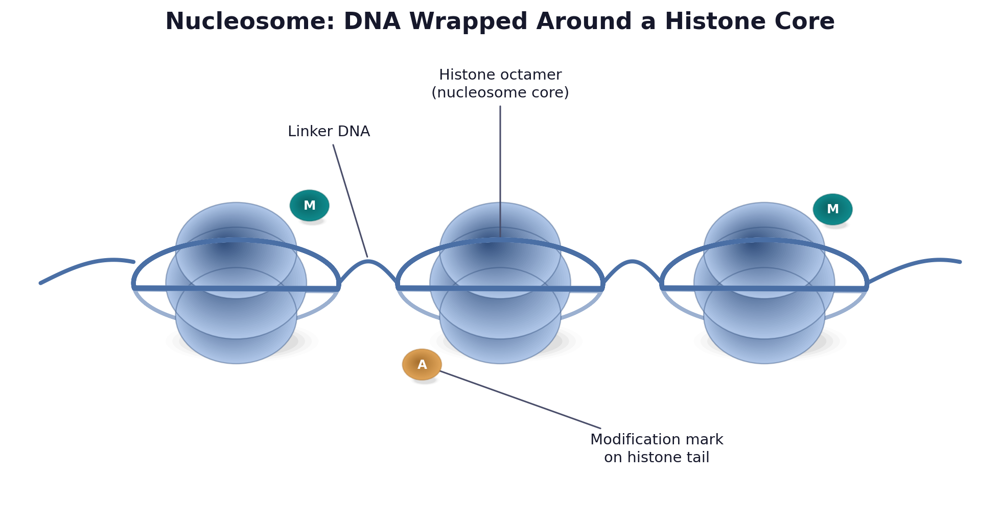<br>
  <sub><b>Figure A.</b> DNA wraps around a core of histone proteins to form a nucleosome; modification marks are added to the protruding histone tails.</sub>
</p>

<p align="center">
  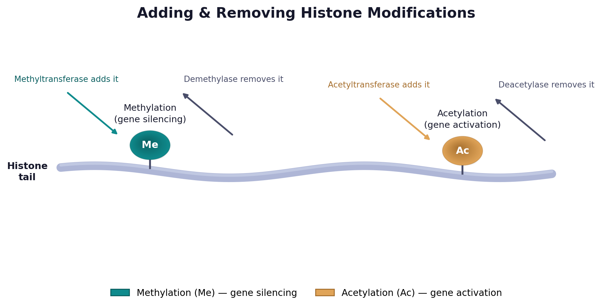<br>
  <sub><b>Figure B.</b> The two modifications this model tracks: methylation (silencing) and acetylation (activation), each added and removed by a dedicated pair of enzymes.</sub>
</p>

<p align="center">
  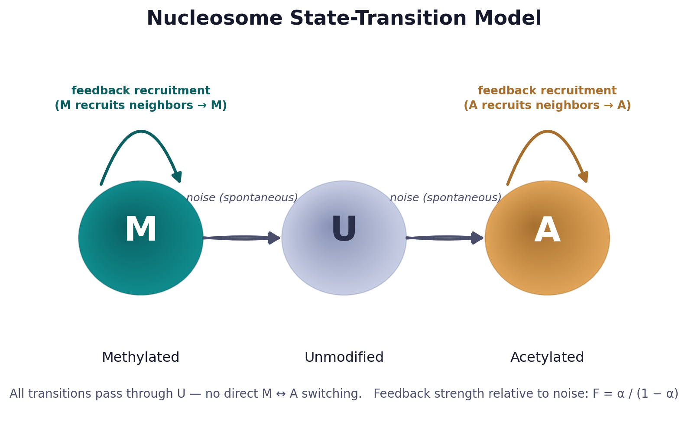<br>
  <sub><b>Figure C.</b> Nucleosomes switch between Methylated (M) and Acetylated (A) states only via the Unmodified (U) intermediate. Each modified state recruits enzymes that reinforce the same modification in neighboring nucleosomes — a positive feedback loop competing against spontaneous noise.</sub>
</p>

Because all transitions pass through the unmodified state (no direct M ↔ A conversion),
the system's long-term behavior is governed by the competition between **feedback**
(recruitment-driven conversion) and **noise** (spontaneous, random state changes).

### 1.1 How a modification actually happens

Each mark is added or removed by a dedicated enzyme — the model's states are a
simplification of real biochemistry:

| Direction | Enzymes involved |
|---|---|
| U → M (methylation) | Methyltransferases |
| M → U (demethylation) | Demethylases |
| U → A (acetylation) | Acetyltransferases |
| A → U (deacetylation) | Deacetylases |

A modified nucleosome can **recruit** the corresponding enzyme to a neighboring,
unmodified nucleosome — converting it to the same state and propagating the mark along
the chromatin fiber. This recruitment is the feedback term in the model; everything
else is noise.

### 1.2 Motivation

The model is motivated by silencing of the mating-type region in fission yeast
(*S. pombe*), monitored experimentally using a *ura4+* reporter gene. This silencing is
associated with **H3K9 methylation** and the proteins **Swi6, Clr4,** and **Clr3/6**,
which read and write the methyl mark. Because a modified nucleosome recruits the same
enzymes to its neighbors, the system forms a feedback loop — raising the core question
this project investigates:

> Can simple feedback plus random noise alone produce chromatin states that are stable
> and heritable?

---

## 2. The Model

- **System:** a linear array of *N* = 60 nucleosomes
- **States:** each nucleosome ∈ {M, U, A}
- **Transitions:** only via U — no direct M ↔ A switching
- **Feedback:** modified nucleosomes recruit enzymes that convert neighbors to the same state
- **Noise:** spontaneous, feedback-independent state changes
- **Control parameter:** feedback-to-noise ratio

<div align="center">

**F = α / (1 − α)**

</div>

where α is the fraction of conversions driven by feedback recruitment rather than
random noise.

<p align="center">
  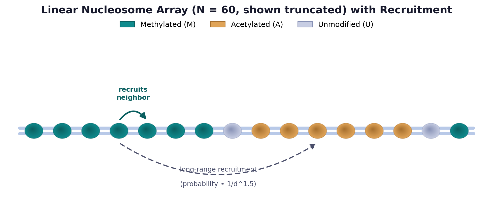<br>
  <sub><b>Figure D.</b> The simulated system: a linear array of N = 60 nucleosomes (truncated here for clarity). A modified nucleosome can recruit its immediate neighbor (solid arrow) or, under the spatial-constraint model, a distant nucleosome with probability decaying as a power law in separation d (dashed arrow) — used to probe the role of long-range interactions in Section 4.5.</sub>
</p>

---

## 3. Methods

The model was implemented independently in Python using a Gillespie-style stochastic
framework.

### 3.1 Kinetic Monte Carlo algorithm

1. Initialize all *N* = 60 nucleosomes randomly in state U, M, or A.
2. Repeat for *T* simulation steps:
   - Randomly pick a nucleosome, n₁.
   - Draw a random number *r* ∈ [0, 1]:
     - **If r < α** (feedback / recruitment): randomly pick a second nucleosome, n₂.
       - If n₂ is M → n₁ converts to M.
       - If n₂ is A → n₁ converts to A.
       - If n₂ is U → no change (nothing to recruit).
     - **Else** (probability 1 − α, noise): convert n₁ to one of the other two states,
       chosen with equal (1/3) probability.
   - Record the counts of M, U, and A.
3. Plot the resulting time series and distributions.

### 3.2 Analyses

Six simulation scripts address different aspects of the model (full mapping
in [§6](#6-repository-structure)):

1. **Time evolution & bistability** — track M(t) and the resulting probability
   distribution P(M) across a range of *F*.
2. **State lifetime** — measure how long a region stays "locked" in a high-M or
   high-A state before switching, using a 1.5× threshold classification rule.
3. **Gap score** — quantify separation between the two stable states as
   G = |M − A| / (M + A).
4. **Cooperativity** — compare three recruitment schemes (Cases A/B/C: full feedback,
   modification-only, demodification-only) with and without cooperative recruitment.
5. **Spatial constraints** — restrict recruitment range (global vs. nearest-neighbor
   vs. power-law decay ∝ 1/d^1.5) to test the role of long-range interactions.

---

## 4. Results

### 4.1 Bistability emerges above a critical feedback-to-noise ratio

<p align="center">
  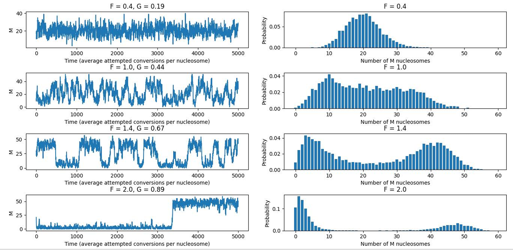<br>
  <sub><b>Figure 1.</b> Time evolution of the methylated fraction M(t) at F = 0.4, 1.0, 1.4, 2.0. A clear bimodal distribution P(M) emerges at high F, indicating strong bistability.</sub>
</p>

### 4.2 State lifetime grows with feedback strength

<p align="center">
  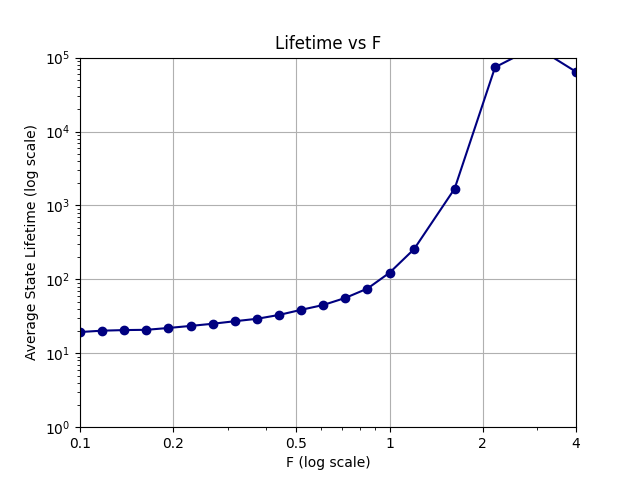<br>
  <sub><b>Figure 2.</b> Average lifetime of a dominant (high-M or high-A) state increases approximately exponentially with F.</sub>
</p>

### 4.3 Gap score shows a sharp transition

<p align="center">
  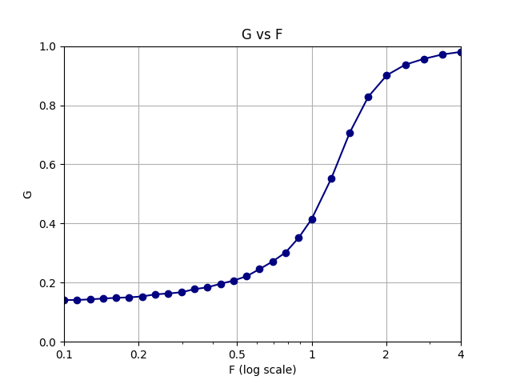<br>
  <sub><b>Figure 3.</b> Gap score G rises sigmoidally with F, with a sharp transition around F ≈ 1.0–1.5, and G → 1 confirms robust bistability at high feedback.</sub>
</p>

### 4.4 Cooperativity is essential only for partial feedback

<p align="center">
  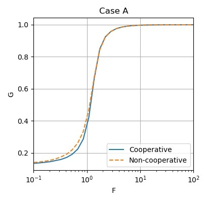
  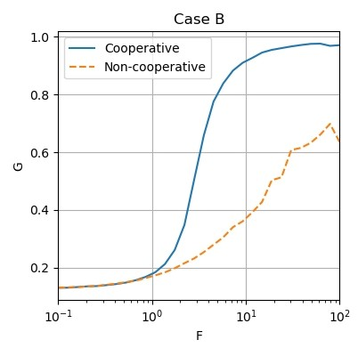
  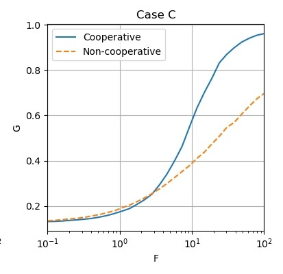<br>
  <sub><b>Figure 4.</b> Case A (full feedback) shows strong bistability even without explicit cooperativity, via implicit two-step recruitment. Case B (modification-only) requires cooperativity for stable memory. Case C (demodification-only) remains weakly bistable even with cooperativity.</sub>
</p>

| Case | Feedback type | Result |
|---|---|---|
| A | Modification + demodification | Strong bistability without explicit cooperativity |
| B | Modification only | Cooperativity required for bistability |
| C | Demodification only | Cooperativity alone is insufficient |

<p align="center">
  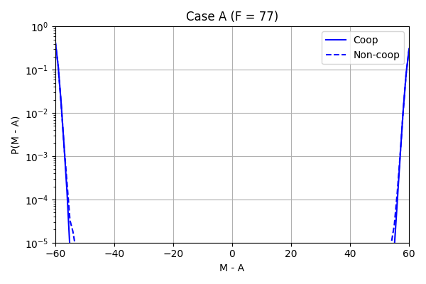
  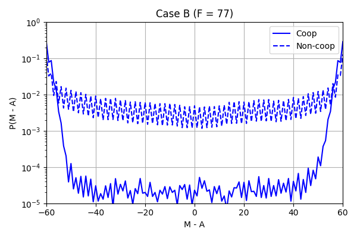
  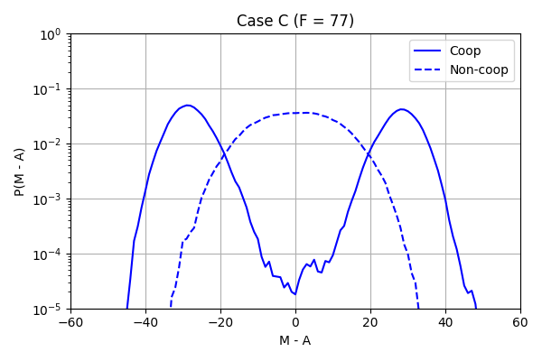<br>
  <sub><b>Figure 4b.</b> P(M − A) distributions at F = 77 for Cases A, B, and C (cooperative vs. non-cooperative). Case A is bimodal regardless of cooperativity; Case C stays broad and centered near zero even with cooperativity.</sub>
</p>

### 4.5 Long-range recruitment matters

<p align="center">
  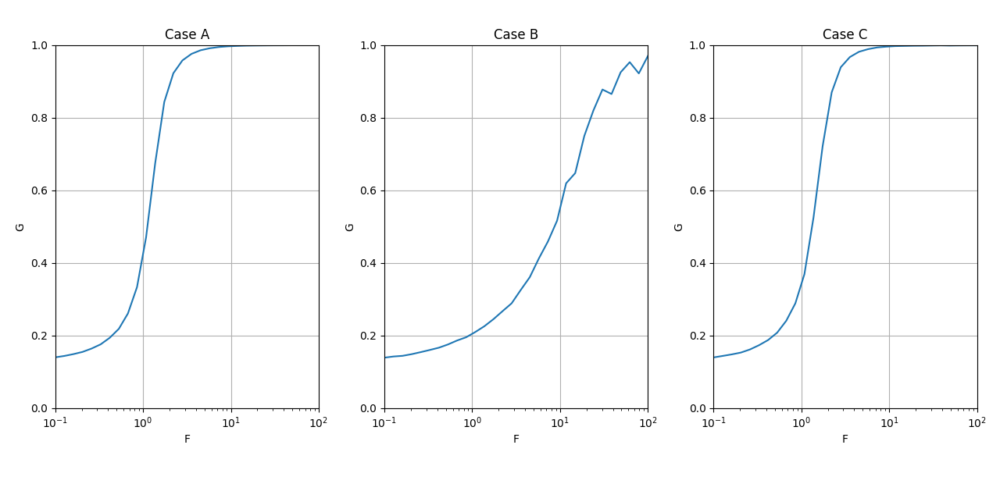<br>
  <sub><b>Figure 5.</b> Restricting recruitment to nearest neighbors sharply weakens bistability; power-law decay (∝ 1/d^1.5), consistent with 3D chromatin folding, partially restores it.</sub>
</p>

<p align="center">
  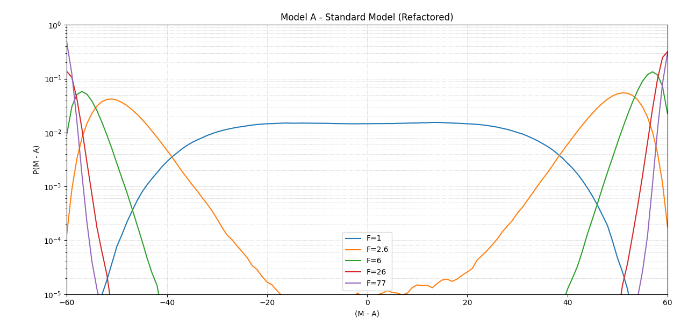
  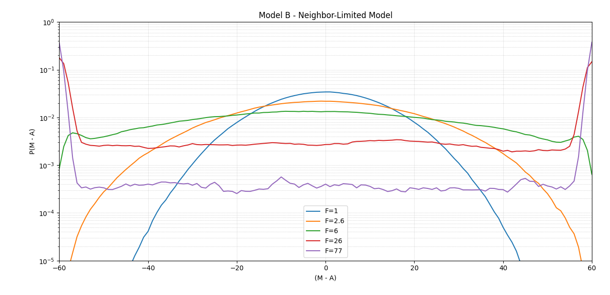
  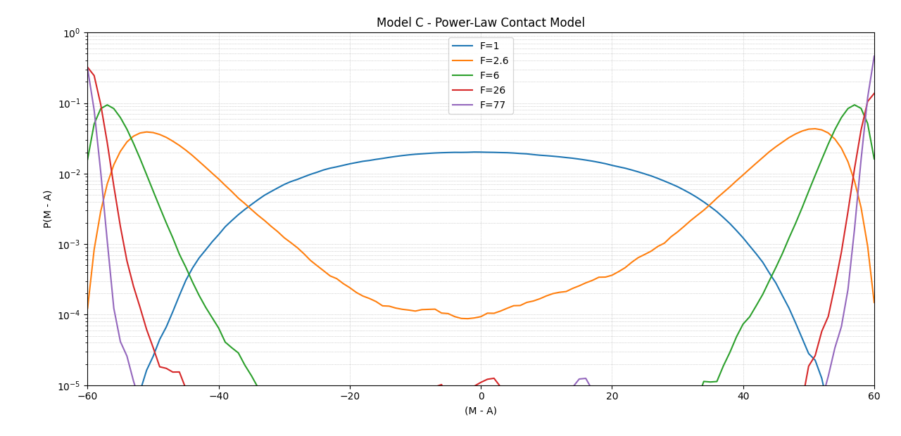<br>
  <sub><b>Figure 5b.</b> P(M − A) distributions for the standard (no constraint), neighbor-limited, and power-law spatial models, across a range of F.</sub>
</p>

| Case | Spatial model | Result |
|---|---|---|
| A | No constraint (global) | Strong bistability |
| B | Nearest-neighbor only | Weak bistability, slow rise in G |
| C | Power-law decay (1/d^1.5) | Moderate bistability restored |

---

## 5. Discussion

- Bistability requires a minimum feedback-to-noise ratio, **F ≳ 1.5**.
- The **full feedback model** (Case A) is intrinsically bistable even without
  explicit cooperativity, because two-step recruitment through U already supplies an
  implicit nonlinearity.
- **Partial feedback** (modification-only) depends critically on cooperative
  recruitment to achieve the same robustness.
- **Long-range recruitment is important**: restricting interactions to nearest
  neighbors substantially weakens memory, while power-law decay — a proxy for
  chromatin's 3D folding — largely restores it.

These results are broadly consistent with the original Dodd *et al.* (2007) findings
and support the view that epigenetic memory is an emergent property of feedback
topology as much as of any single molecular mechanism.

---

## 6. Repository Structure

```
epigenetic-memory-dodd2007/
│
├── simulation/
│   ├── bistability.py                  # Time evolution & bistability        → Fig. 1
│   ├── lifetime_gap_score.py           # Lifetime & gap score vs F           → Fig. 2, 3
│   ├── cooperativity_gap_score.py      # G vs F, Cases A/B/C                 → Fig. 4
│   ├── cooperativity_distribution.py   # P(M−A) under cooperativity
│   ├── spatial_constraints.py          # G vs F, spatial models              → Fig. 5
│   └── spatial_distribution.py         # P(M−A) under spatial constraints
│
├── results/
│   └── (simulation graphs — see Section 4 for filenames)
│
├── requirements.txt
└── README.md
```

---

## 7. How to Run

**Install dependencies**
```bash
pip install numpy matplotlib
```

**Run any simulation**
```bash
python simulation/bistability.py
python simulation/lifetime_gap_score.py
python simulation/cooperativity_gap_score.py
python simulation/cooperativity_distribution.py
python simulation/spatial_constraints.py
python simulation/spatial_distribution.py
```

> **Note:** the cooperativity and spatial-constraint simulations are computationally
> heavy and may take several minutes to hours depending on your system.

---

## 8. References

Dodd, I. B., Micheelsen, M. A., Sneppen, K., & Thon, G. (2007).
**Theoretical Analysis of Epigenetic Cell Memory by Nucleosome Modification.**
*Cell*, 129(4), 813–822. https://doi.org/10.1016/j.cell.2007.02.053

---

## 9. Acknowledgements

I thank **Dr. Ranjith Padinhateeri** (IIT Bombay) for the opportunity to work in his
lab and for his guidance, and **Vinoth M.** (Ph.D. Scholar) for his mentorship and
support throughout this project. I also thank **SIES College of Arts, Science &
Commerce (Autonomous)** for facilitating this OJT opportunity.

<sub>M.Sc. Physics · SIES College, Mumbai · OJT at Physical Biology Lab, IIT Bombay · 2025</sub>
